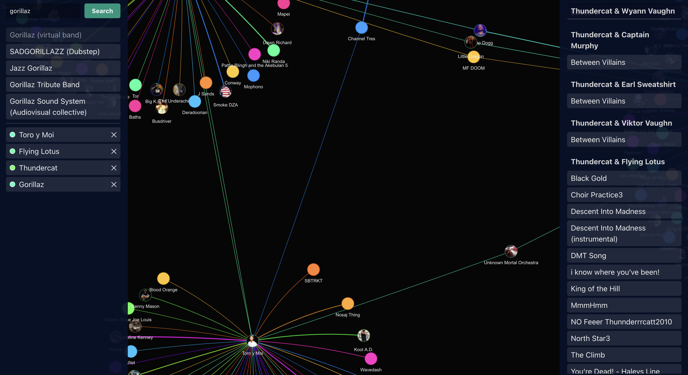

# Music Collab Explorer



The **Music Collab Explorer** is a web app for discovering collabs between musical artists.

Using data from the excellent [MusicBrainz](https://musicbrainz.org/) project, you can search for any artist and visualize their collabs in a dynamic graph.

## Features
- Search for an artist, and click one of the results to add them to the artist list.
- Artists in the list will be shown in the graph.
  - Their collaborators will be shown in the graph as well, if the "Show only selected" checkbox is not checked.
- Double-click on any artist in the graph to view their collabs.
- All artists who have collabed are connected.
- Click on any graph node or edge to view more information.
  - Clicking a node will list all the collab songs of that artist.
  - Clicking an edge will list all the collab songs between the artists connected by the edge.

## Getting Started

## Prerequisites
- [Deno](https://deno.land/) installed.
- A PostgreSQL database v16.1 or greater (a script is provided to help populate it with a dump from the MusicBrainz database).

## Installation

Clone the repository:
```sh
git clone git@github.com:KaeruCT/music-collab-explorer.git
cd music-collab-explorer
```

Set up env vars:
```sh
cp .env.example .env
```
Modify `.env` as needed to configure database credentials.

## Running the Application
### Development Mode
```sh
deno task dev
```

### Building for Production
```sh
deno task build
```

### Starting the Server
```sh
deno task start
```

# Database Setup

This application requires a local copy of the MusicBrainz database. The setup process involves downloading the MusicBrainz dump, hydrating a local database, and optionally syncing with a remote replica.

## Initial Database Setup

1. Navigate to the `setup/` directory:
   ```sh
   cd setup/
   ```

2. Run the database initialization script to download and import MusicBrainz data:
   ```sh
   ./init_db.sh
   ```
   **Note**: This script requires PostgreSQL superuser access (connects as `postgres` user) to create/drop databases and users. Only run this for local database setup.
   
   This script will:
   - Download the latest MusicBrainz dump (several GB - takes time)
   - Create a database with the required schema
   - Import only the relevant tables for the music collab explorer
   - Create necessary indexes

3. (Optional) Remove superuser privileges from the MusicBrainz user:
   ```sql
   ALTER USER musicbrainz WITH NOSUPERUSER;
   ```

## Database Synchronization with Remote Replica

After setting up your local database, you can sync it with a remote replica database. This enables deploying the application on a proper server on the internet.

### Prerequisites for Sync
- Local MusicBrainz database already initialized (via `init_db.sh`)
- Remote PostgreSQL database configured and accessible
- Environment variables configured for both local and remote databases in `.env`

### Environment Configuration
Configure your `.env` file based on `.env.example` with the necessary database connection details for both your local database and the remote replica.

### Running the Sync
Execute the sync script to transfer new/updated records from your local database to the remote replica:

```sh
cd setup/
./sync_db.sh
```

The sync process:
1. Identifies the highest ID in each table on the remote replica
2. Exports records with IDs greater than the remote maximum from the local database
3. Imports the new records into the remote replica

**Note**: The sync is one-way (local → remote) and assumes auto-incrementing primary keys for change detection.

# Future Improvements
- Improve artist images by using additional sources, only Wikimedia is used at the moment and it's missing many artists.
- Allow to play tracks within the visualization. Currently, the tracks are only Youtube search links.

# Acknowledgments
- **MusicBrainz** for providing open music metadata. This project would be impossible without them. [Please contribute!](https://musicbrainz.org/doc/How_to_Contribute)
- **vis-network** for the excellent graph visualization.
